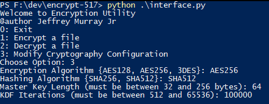
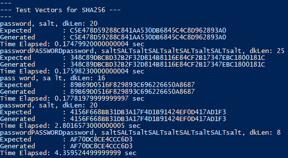
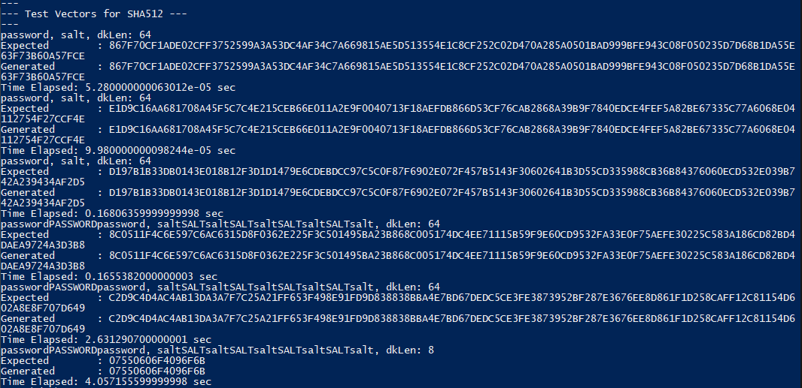
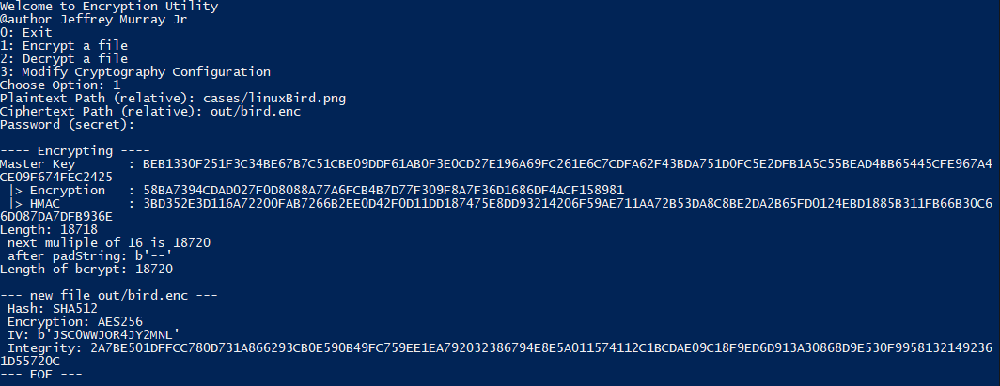
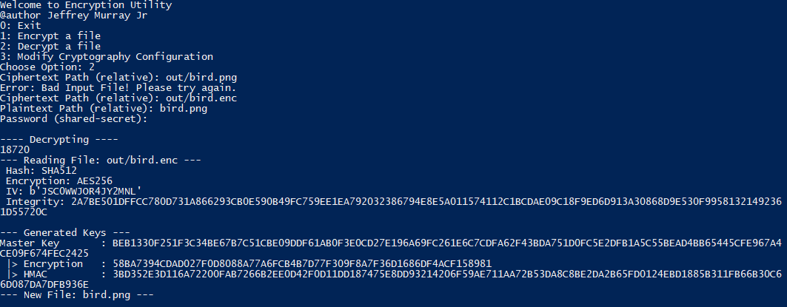

# Encryption Assignment
CSS 577 - Spring 2021 \
Jeffrey Murray Jr

---

## Purpose
A program which will encrypt **ANY** file with the following approach:
1. Generate a Master Key using PBKDF2-HMAC with choice of hashing function 
2. Derive an Encryption and an HMAC key using PBKDF#2 with 1 iteration
3. Encrypting data using CBC chaining mode with choice of algorithms 
4. Create an integrity hash of IV+ciphertext to ensure data has not been manipulated or tampered with

## Set Up & Install Options
There are two options to run the source code. \
This can be run on Linux, Mac or Windows OS either for deployment (on Docker) or development (python environment)

### Pipenv
1. Install Python 3.8.5 or higher on host OS
2. Install Pip for python distribution (pip or pip3)
3. Install Pipenv via:
```bash
$ pip install pipenv
```
4. Initialize & Install requirements.txt
```bash
$ pipenv shell
$ pip install -r requirements.txt
```

### DockerFile
To Build DockerFile:
```bash 
$ cd repo/
$ docker build -t name:version .
```
To Run Docker Image
``` bash
$ docker run -it name:version bash 
```
To Run with attached persistant volume use:
```bash
$ docker run -it -v <Folder Name>:<Some Arbitrary Folder on the instance> name:version python bash
```

## Compatible Algorithms
Modular implementation allows for more algorithms.
``` python
def capability(plainAlgo):
    '''
    Allow for extension for new crypto & cipher options
    Uses the pycryptodome aka Crypto
    '''
    switch = {
        # Cipher
        'AES128': AES,
        '3DES' : DES3, 
        'AES256': AES,
        # Hashing
        'SHA256': SHA256,
        'SHA512': SHA512,
    }

    return switch.get(plainAlgo, None)
```

## User Interface & Test-Vectors
``` 
interface.py: Handles path exceptions and algorithm capabilities
```

```
perf.py: Test-Vectors with TimeIt function on various password, salt, and key lengths + number of iterations
Note: Only runs timeit for a single loop
```


## Source Files
```
encrypt.py: Generates random salt & keys to encrypt a file from config.py 
    @param  Passphrase
            Key Derivation Iterations
```

```
decrypt.py: Reads metadata from header (line 1) & generates keys locally with input passphrase
    @header Hash Algorithm
            Cipher Algorithm
            Master Key Length
            Initialization Vector
            KDF iterations
            Integrity: HMAC: IV + Ciphertext
            3 Random Salt Vectors: Master Salt, HMAC Salt, Encryption Salt
            Padding Length: Pads end of file with hyphens to fit to block size
```
